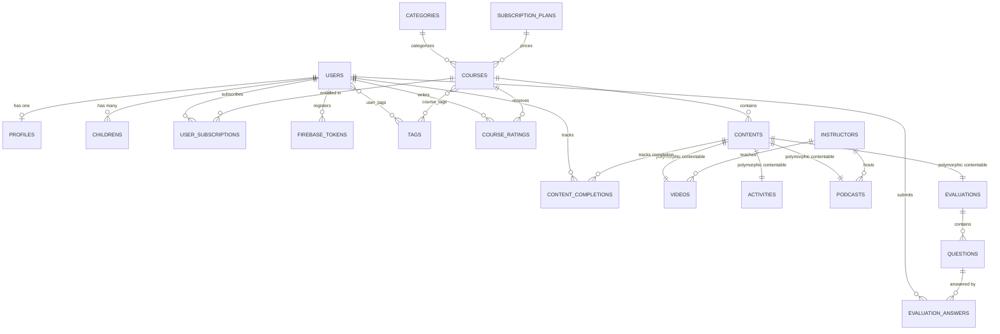

# NOUMOUW Backend

NOUMOUW is a child development, parenting, and behavioral guidance platform backend built with Laravel 11. It provides a RESTful API for mobile/client applications and a Web-based Admin Dashboard. The system supports structured multi-content courses (videos, activities, audio podcasts, and evaluations/assessments), child profiling, progress tracking, behavioral tagging, in-app subscription synchronization via RevenueCat webhooks, push notifications with Firebase Cloud Messaging (FCM), chunked media uploads, and HTTP byte-range video streaming.

---

## Table of Contents

- [Features](#features)
- [Tech Stack](#tech-stack)
- [Project Structure](#project-structure)
- [Prerequisites](#prerequisites)
- [Installation and Setup](#installation-and-setup)
- [Configuration](#configuration)
- [Usage](#usage)
  - [Development Server](#development-server)
  - [Core REST API Endpoints](#core-rest-api-endpoints)
  - [Web Admin Panel](#web-admin-panel)
- [Data Model & Architecture](#data-model--architecture)
- [Testing & Code Quality](#testing--code-quality)
- [Deployment](#deployment)
- [Contributing](#contributing)
- [License](#license)
- [Author / Contact](#author--contact)

---

## Features

### Authentication & User Profiles
- **API Authentication:** Token-based authentication using Laravel Sanctum.
- **OTP Verification & Password Recovery:** Email-based 6-digit OTP delivery for registration and password reset flows using `ichtrojan/laravel-otp`.
- **Parent & Child Profiling:** Manage parent profiles (role, country, birth date) and track multiple children (names, birth dates).
- **Behavioral & Interest Tagging:** Map developmental needs and conditions (e.g., hyperactivity, autism, anxiety, speech delays) to user profiles and courses for tailored recommendations.

### Educational Content & Course Delivery
- **Polymorphic Course Content:** Courses compose 4 distinct content modules:
  - **Videos:** Streamable video lessons linked with instructors, thumbnails, and watch progress tracking.
  - **Activities:** Step-by-step guidance with multi-image workflows.
  - **Podcasts:** Audio episodes with instructors and MP3 playback.
  - **Evaluations & Quizzes:** Dynamic multi-question assessments with instant scoring, wrong-answer breakdowns, and reference resource links.
- **Progress & Completion Tracking:** Track percentage progress per course and mark individual content items as completed.
- **Course Ratings & Reviews:** Subscribed users can submit ratings (1–5 stars) and reviews.
- **HTTP Byte-Range Streaming:** Chunked 206 Partial Content video streaming supporting seeking and bandwidth management.
- **Resilient Media Uploads:** Chunked upload sessions (`ChunkFileUpload` trait & FilePond integration) for large video/audio files.

### Subscriptions & Webhooks
- **RevenueCat Integration:** Webhook handler for `INITIAL_PURCHASE`, `RENEWAL`, `CANCELLATION`, and `EXPIRATION` events to synchronize subscription statuses and course access.
- **Subscription Plans:** Configurable subscription tiers (monthly/yearly) linked with in-app purchase product identifiers.

### Notifications & Communication
- **Firebase Cloud Messaging (FCM):** Push notification delivery with device token registration and admin broadcasting (all users or targeted user IDs).
- **Email Dispatch:** Support ticket routing, contact form submissions, and transactional OTP emails.
- **User Notification Preferences:** Granular user opt-in controls for push notifications and email newsletters.

### Administration & CMS
- **Modern Admin Dashboard:** Enrollment analytics (7-day and 30-day dynamic charts), revenue summaries, and content counters.
- **DataTables Integration:** Server-side pagination, searching, and status toggling via Yajra DataTables.
- **Dynamic Content & Legal Pages:** CMS for custom pages, terms of service, and privacy policies.
- **System Settings Management:** Real-time configuration of logos, favicons, branding, SMTP mail credentials, Stripe payment keys, and Social OAuth (Google, Facebook, Apple).

---

## Tech Stack

### Backend & Core
- **Language:** PHP 8.2+
- **Framework:** Laravel 11.9+
- **Database:** MySQL / MariaDB (Compatible with PostgreSQL / SQLite)
- **API Authentication:** Laravel Sanctum 4.0+
- **OTP Management:** `ichtrojan/laravel-otp` 2.0+
- **Push Notifications:** `kreait/laravel-firebase` 5.9+ (Firebase Admin SDK)
- **Media Processing:** `php-ffmpeg/php-ffmpeg` 1.3+ & `rahulhaque/laravel-filepond` 11.0
- **Admin Tables:** `yajra/laravel-datatables` 11.0+
- **Flash Messages:** `php-flasher/flasher-laravel` 2.0+

### Frontend (Admin Dashboard & Blade Views)
- **Build Tool:** Vite 5.0+
- **Styling:** Tailwind CSS 3.4+, PostCSS, Flowbite 2.5+
- **Scripting:** Alpine.js 3.4+, Axios 1.7+, Flatpickr 4.6+
- **Realtime / Broadcasting:** Laravel Echo 1.16+, Pusher-JS 8.4+

---

## Project Structure

```
Noumouw_Backend/
├── app/
│   ├── Enums/                 # Application enums (OrderStatus, PaymentType, Status)
│   ├── Helpers/               # Helper classes (Helper.php, VideoStream.php, helper_functions.php)
│   ├── Http/
│   │   ├── Controllers/
│   │   │   ├── API/           # REST API controllers (Auth, Courses, Content, FCM, RevenueCat, etc.)
│   │   │   ├── Web/           # Web & Admin controllers (Dashboard, Courses, Videos, Users, Settings)
│   │   │   └── Controller.php # Base controller
│   │   ├── Middleware/        # Custom middleware (e.g., AdminMiddleware)
│   │   ├── Requests/          # Form request validators (e.g., RegisterRequest)
│   │   └── Resources/         # Eloquent API JSON resources (Course, Content, Video, Tag, etc.)
│   ├── Mail/                  # Mailable classes (OTP.php, ContactMail.php)
│   ├── Models/                # Eloquent models (Course, Content, Video, User, Subscription, etc.)
│   ├── Notifications/         # Database and broadcast notification classes
│   ├── Providers/             # Service providers
│   ├── Services/              # Third-party service integrations (FCMService.php)
│   └── Traits/                # Reusable traits (ChunkFileUpload.php)
├── bootstrap/
│   └── app.php                # Application bootstrapping, middleware & API exception formatting
├── config/                    # Configuration files (app, database, services, filesystems, ffmpeg, etc.)
├── database/
│   ├── factories/             # Model factories for testing and database seeding
│   ├── migrations/            # Database schema migrations
│   └── seeders/               # Database seeders (DatabaseSeeder, TagsSeeder, CourseSeeder)
├── public/                    # Web root, compiled assets, and uploaded public files
├── resources/
│   ├── css/                   # Stylesheets and Tailwind CSS entrypoints
│   ├── js/                    # JavaScript entrypoints
│   └── views/                 # Blade templates (admin layouts, emails, auth, frontend)
├── routes/
│   ├── api.php                # API route definitions and media streaming routes
│   ├── api_auth.php           # Public & Sanctum-protected REST API routes
│   ├── auth.php               # Web authentication routes (Laravel Breeze)
│   ├── common.php             # Admin panel resource and management routes
│   ├── console.php            # Artisan console commands
│   └── web.php                # Web entry routes and database utility endpoints
├── storage/                   # File storage, cache, session data, and private media files
├── tests/
│   ├── Feature/               # Feature tests (Auth, Profile, Registration, Verification)
│   └── Unit/                  # Unit tests
├── .env.example               # Environment variable templates
├── composer.json              # PHP dependencies and autoloading definitions
├── package.json               # Node.js dependencies and frontend build scripts
├── phpunit.xml                # PHPUnit test configuration
├── tailwind.config.js         # Tailwind CSS styling configuration
└── vite.config.js             # Vite asset bundler configuration
```

---

## Prerequisites

Ensure the following dependencies are installed on your environment:

- **PHP:** `^8.2` with extensions enabled: `BCMath`, `Ctype`, `Fileinfo`, `JSON`, `Mbstring`, `OpenSSL`, `PDO`, `pdo_mysql`, `Tokenizer`, `XML`, `cURL`
- **Composer:** `^2.2`
- **Node.js & NPM:** Node.js `^18.0` / `^20.0` & NPM `^9.0`
- **Database Server:** MySQL `^8.0` or MariaDB `^10.4`
- **FFmpeg & FFprobe:** Optional / Recommended for local video transcoding and metadata inspection

---

## Installation and Setup

### 1. Clone the Repository
```bash
git clone <repository_url>
cd Noumouw_Backend
```

### 2. Install PHP Dependencies
```bash
composer install
```

### 3. Install Node Dependencies
```bash
npm install
```

### 4. Configure Environment
Copy the `.env.example` file to `.env`:
```bash
cp .env.example .env
```
Generate an application key:
```bash
php artisan key:generate
```

### 5. Configure Database and Storage
Create your database (default name: `noumouw`) in MySQL, then configure your `.env`:
```env
DB_CONNECTION=mysql
DB_HOST=127.0.0.1
DB_PORT=3306
DB_DATABASE=noumouw
DB_USERNAME=root
DB_PASSWORD=your_password
```

Run database migrations and seed default data:
```bash
php artisan migrate --seed
```

Create the symbolic link for public file storage:
```bash
php artisan storage:link
```

### 6. Firebase Service Account (Optional / For Push Notifications)
Place your Firebase Admin SDK JSON credentials inside `storage/app/private/` and update `config/services.php` or your `.env` accordingly.

### 7. Compile Frontend Assets
```bash
# For development with hot reloading
npm run dev

# For production build
npm run build
```

---

## Configuration

Key environment variables in `.env`:

| Variable | Type | Default / Example | Description |
|---|---|---|---|
| `APP_NAME` | string | `NOUMOUW` | Application name displayed across emails and panel |
| `APP_ENV` | string | `local` | Environment (`local`, `production`, `testing`) |
| `APP_KEY` | string | *generated* | Laravel application encryption key |
| `APP_DEBUG` | boolean | `true` | Debug mode toggle |
| `APP_URL` | string | `http://localhost:8000` | Base URL of the application |
| `DB_CONNECTION` | string | `mysql` | Primary database driver (`mysql`, `sqlite`, `pgsql`) |
| `DB_HOST` | string | `127.0.0.1` | Database server host |
| `DB_PORT` | integer | `3306` | Database server port |
| `DB_DATABASE` | string | `noumouw` | Database schema name |
| `DB_USERNAME` | string | `root` | Database username |
| `DB_PASSWORD` | string | `root` | Database password |
| `FILESYSTEM_DISK` | string | `local` | Default storage disk (`local`, `public`, `s3`) |
| `SESSION_DRIVER` | string | `database` | Session store driver (`database`, `file`, `redis`) |
| `QUEUE_CONNECTION` | string | `database` | Queue connection driver (`database`, `redis`, `sync`) |
| `MAIL_MAILER` | string | `smtp` | Mail driver (`smtp`, `sendmail`, `ses`, `log`) |
| `MAIL_HOST` | string | `smtp.mailtrap.io` | SMTP server host |
| `MAIL_PORT` | integer | `465` / `587` | SMTP server port |
| `MAIL_USERNAME` | string | `null` | SMTP authentication username |
| `MAIL_PASSWORD` | string | `null` | SMTP authentication password |
| `MAIL_ENCRYPTION` | string | `ssl` / `tls` | SMTP transport encryption |
| `MAIL_FROM_ADDRESS` | string | `no-reply@noumouw.com` | Default sender email address |
| `REVENUECAT_WEBHOOK_SECRET` | string | `null` | Authorization secret for incoming RevenueCat webhooks |
| `FFMPEG_BINS` | string | `C:/ffmpeg/ffmpeg.exe` | Path to FFmpeg executable binary |
| `FFPROBE_BINS` | string | `C:/ffmpeg/ffprobe.exe` | Path to FFprobe executable binary |

---

## Usage

### Development Server

Start the PHP development server:
```bash
php artisan serve
```

Start the Vite asset development server:
```bash
npm run dev
```

Run background queues (if sending emails or asynchronous notifications):
```bash
php artisan queue:work
```

---

### Core REST API Endpoints

All API endpoints return standard JSON responses using the application envelope structure:
```json
{
  "status": true,
  "message": "Response description",
  "code": 200,
  "data": {}
}
```

#### Authentication & User Management

| Method | Endpoint | Auth | Description |
|---|---|---|---|
| `POST` | `/api/register` | Guest | Register new user with profile & children data. Returns OTP token. |
| `POST` | `/api/verify_email` | Guest | Verify email with 6-digit OTP and receive Sanctum Bearer token. |
| `POST` | `/api/resend_otp` | Guest | Resend verification OTP to user email. |
| `POST` | `/api/login` | Guest | Authenticate user with email and password. |
| `POST` | `/api/forgot-password` | Guest | Send password recovery OTP. |
| `POST` | `/api/verify-otp` | Guest | Validate recovery OTP and obtain password reset token. |
| `POST` | `/api/reset-password` | Guest | Reset user password using token. |
| `GET` | `/api/user` | Sanctum | Fetch authenticated user details with profile and children. |
| `POST` | `/api/profile-update` | Sanctum | Update user name, avatar, parent details, and children. |
| `DELETE` | `/api/profile/delete` | Sanctum | Delete authenticated user account. |
| `POST` | `/api/logout` | Sanctum | Revoke current user access token. |

#### Courses & Content Delivery

| Method | Endpoint | Auth | Description |
|---|---|---|---|
| `GET` | `/api/courses` | Sanctum | List active courses filtered by user tags, search query, and pagination. |
| `GET` | `/api/course/{id}` | Sanctum | Fetch full course details with ordered polymorphic contents and tags. |
| `GET` | `/api/course/plan` | Sanctum | Retrieve subscription plan details for a specific course (`course_id` query). |
| `POST` | `/api/course/subscribe` | Sanctum | Subscribe user to course and initialize content completion trackers. |
| `GET` | `/api/course/subscribed-course` | Sanctum | List all active subscribed courses for the user. |
| `DELETE` | `/api/course/unsubscribe/{id}` | Sanctum | Unsubscribe from a course and reset completion progress. |
| `GET` | `/api/progress` | Sanctum | Retrieve overall completion percentages across subscribed courses. |
| `GET` | `/api/contents` | Sanctum | List all content items with associated course metadata. |
| `GET` | `/api/content/{id}` | Sanctum | Get single content details. |
| `POST` | `/api/content/completion/{id}` | Sanctum | Mark a content item as complete (`is_complete: "Yes"` or `"No"`). |
| `GET` | `/api/activities` | Sanctum | List all activity content items. |
| `GET` | `/api/activity/{id}` | Sanctum | Fetch activity details with instruction image URLs. |
| `GET` | `/api/podcasts` | Sanctum | List all audio podcasts. |
| `GET` | `/api/podcast/{id}` | Sanctum | Fetch single podcast audio details and instructor. |
| `GET` | `/api/videos` | Sanctum | List all video items. |
| `GET` | `/api/video/{id}` | Sanctum | Get video details, instructor, and linked course. |
| `GET` | `/api/video/stream/{id}` | Sanctum | Stream video with HTTP 206 Partial Content range support. |
| `POST` | `/api/video/{videoId}/update-progress` | Sanctum | Update watch progress percentage (`0-100`). |
| `GET` | `/api/video/{videoId}/progress` | Sanctum | Retrieve saved video watch progress. |

#### Evaluations & Quizzes

| Method | Endpoint | Auth | Description |
|---|---|---|---|
| `GET` | `/api/evaluations` | Sanctum | List all evaluation modules. |
| `GET` | `/api/evaluation/{id}` | Sanctum | Get evaluation with questions and answer options. |
| `POST` | `/api/evaluations/answer` | Sanctum | Submit array of question answers (`course_id`, `evaluation_id`, `question_id`, `answer`). |
| `GET` | `/api/evaluations/result/{id}` | Sanctum | Get evaluation result summary, score, and wrong-answer explanations. |

#### Reviews, Push Notifications & Webhooks

| Method | Endpoint | Auth | Description |
|---|---|---|---|
| `GET` | `/api/ratings?course_id={id}` | Sanctum | List active reviews and ratings for a course. |
| `POST` | `/api/ratings/store` | Sanctum | Create or update course rating (1–5) and review message. |
| `DELETE` | `/api/ratings/delete/{id}` | Sanctum | Delete own rating review. |
| `POST` | `/api/firebase/token/add` | None/Auth | Register FCM device token for push notifications. |
| `POST` | `/api/revenuecat/webhook` | Webhook Secret | Handle in-app subscription lifecycle events from RevenueCat. |
| `POST` | `/api/contact/support` | Sanctum | Submit support inquiries and dispatch support email. |

---

### Example API Requests & Responses

#### User Registration
**Request:**
`POST /api/register`
```json
{
  "name": "Sarah Jenkins",
  "email": "sarah@example.com",
  "password": "Password123!",
  "date_of_birth": "1992-05-14",
  "parent_role": "mother",
  "is_parent": 1,
  "country": "United States",
  "children": [
    {
      "name": "Leo",
      "date_of_birth": "2020-08-10"
    }
  ]
}
```

**Response (201 Created):**
```json
{
  "status": true,
  "message": "Register successfully",
  "code": 201,
  "data": {
    "otp": "492015"
  }
}
```

#### User Login
**Request:**
`POST /api/login`
```json
{
  "email": "sarah@example.com",
  "password": "Password123!"
}
```

**Response (200 OK):**
```json
{
  "status": true,
  "message": "Login Successful",
  "token_type": "Bearer",
  "token": "1|qPz68cE4d51xWqZ7...",
  "data": {
    "id": 2,
    "name": "Sarah Jenkins",
    "email": "sarah@example.com",
    "avatar": "http://localhost:8000/uploads/user/avatar/user-1.jpg",
    "accept_push_notifications": true,
    "email_newsletter": true
  }
}
```

---

### Web Admin Panel

Access the web interface at `http://localhost:8000/login`.

Default seeded credentials (from `DatabaseSeeder`):
- **Admin Email:** `admin@admin.com`
- **Admin Password:** `12345678`
- **User Email:** `user@user.com`
- **User Password:** `12345678`

The admin dashboard provides:
- **Course Studio:** Visual course builder with drag-and-drop order rearrangement and polymorphic media association.
- **Push Notification Center:** Dispatch instant Firebase push notifications with custom titles, images, and recipient targeting.
- **Support Desk:** Monitor user inquiries, review tickets, and mark tickets as pending, resolved, or closed.
- **System Settings:** Update site branding, logos, SMTP credentials, Stripe keys, and OAuth social login parameters.

---

## Data Model & Architecture



---

## Testing & Code Quality

### Running Tests
Execute the PHPUnit test suite:
```bash
php artisan test
```
Or run PHPUnit directly:
```bash
./vendor/bin/phpunit
```

### Code Style & Formatting
Format and lint PHP code using Laravel Pint:
```bash
./vendor/bin/pint
```

---

## Deployment

### 1. Production Optimization
When deploying to production environments, optimize route, config, and view caches:
```bash
composer install --optimize-autoloader --no-dev
php artisan config:cache
php artisan route:cache
php artisan view:cache
npm run build
```

### 2. Queue Worker (Supervisor)
Ensure the Laravel queue worker runs continuously for asynchronous emails and push notifications:
```bash
php artisan queue:work --sleep=3 --tries=3 --max-time=3600
```

### 3. Web Server Configuration
Point your web server's document root (Nginx or Apache) to the `/public` directory:
- **Nginx:** Ensure `try_files $uri $uri/ /index.html /index.php?$query_string;` is configured.
- **File Permissions:** Ensure `storage/` and `bootstrap/cache/` are writable by the web server user (`chown -R www-data:www-data storage bootstrap/cache`).

---

## Contributing

1. Fork the repository.
2. Create a feature branch (`git checkout -b feature/your-feature-name`).
3. Commit your changes with clear messages (`git commit -m "Add feature description"`).
4. Push to your branch (`git push origin feature/your-feature-name`).
5. Open a Pull Request.

